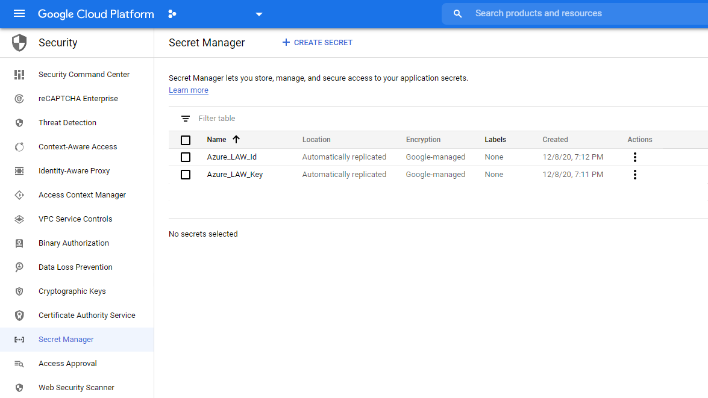
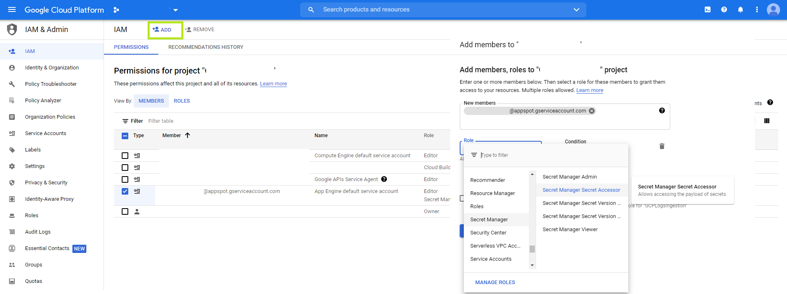

# GCP Cloud Functions – Installation / Setup Guide

## **Function Flow process**

**Normal Flow:**
Stackdriver Logging -> Logging Export -> PubSub Topic -> GCP Function -> Azure Log Analytics

**Error Flow:** 
Stackdriver Logging -> Logging Export -> PubSub Topic -> GCP Function -> PubSub Topic (error:RetryTopic)
Cloud Schedule -> PubSub Topic (Trigger) -> GCP Function(->Pull from PubSub Retry Topic)-> Azure Log Analytics

For more information visit https://cloud.google.com/logging/docs/routing/overview

## **Pre-requisites**

This function requires Cloud Functions API to be enabled.
This function requires Cloud Scheduler API to be enabled on the Project. (https://cloud.google.com/scheduler/docs/setup and click on the link on the bottom <ENABLE THE CLOUD SCHEDULER API>). Also make sure Cloud Scheduler has an assigned default region.
Set up Stackdriver logs; create an export(s) and subscription to a PubSub Topic (see important note below)
Set up a PubSub Topic for error messages (Note the name of the topic -  this will be used in the Environment variables later)

**This function requires Secrets Manager to store Azure Log Analytics WORKSPACE ID and WORKSPACE KEY and provide Secret Name in the Environment Variables section.**

For example

Grant Permissions to App service account inorder to retrieve secret values programmatically in cloud function

1. Go to IAM
2. Select you app service account and click on "Add" on top - refer the following diagram
	

## **Function Dependencies:**
PubSub Function requires the Retry Function. Install and set up the Retry Function first

## Install with gcloud CLI

This example will create 2 example Log Export Sinks, 3 PubSub Topics and use the PubSub Function with a Retry Function. A Cloud Schedule is also created to trigger the Retry Function (via PubSub Topic).

#### Log export Sinks Created:

<table><tr><td><strong>Sink</strong></td><td><strong>Description</strong></td><td><strong>Filter</strong></td></tr>
<tr><td>LogsExporterSinkForFunctions</td><td>Selects all GCP Function logs. Important note that it filters out the PubSub Function!!</td><td>resource.labels.function_name!="Ingest-GCP-Logs-To-Azure-Sentinel"</td></tr>
<tr><td>LogsExporterSinkForFunctions</td><td>Selects all Kubernetes/containers logs</td><td>protoPayload.serviceName="container.googleapis.com"</td></tr></table>

**Caution: With aggregated export sinks, you can export a very large number of log entries. Design your logs query carefully.**

#### PubSub Topics Created:

**GCPLogsTopic** : This topic will collect logs from the export sinks

**GCPLogsRetryTopic** : This topic will collect failed writes from Ingest-GCP-Logs-To-Azure-Sentinel to 

**GCPToAzSentinelRetryTrigger** : This topic triggers retries based on Cloud Schedule

#### GCP Functions Created:

**Ingest-GCP-Logs-To-Azure-Sentinel** : PubSub Function pulling from GCPLogsTopic 

**Retry-Ingest-GCP-Logs-To-Azure-Sentinel** : Retry Function to pull any failed messages from Ingest-GCP-Logs-To-Azure-Sentinel

## Run in bash or the GCP Cloud Shell

**Note that you will need to change values in bold in the scripts below to identify your project id, HEC URL and HEC Token**
You can also change the OS environment variables in the first section to fit your needs
Note to use your Project ID, and not Project Name / Number

When running the scripts the first time in a new project, if asked, accept the queries to create/initialise services

<pre>

#set OS environment variables for script. Change these for your deployment

MY_PROJECT=<strong>MY_PROJECT</strong> (Project ID)
PUBSUB_FUNCTION=Ingest-GCP-Logs-To-Azure-Sentinel

PUBSUB_TOPIC=GCPLogsTopic
PUBSUB_SINK1=LogsExporterSinkForFunctions
PUBSUB_SINK2=LogsExporterSinkNoFunctions

WORKSPACE_ID=<strong>Secret Name for Azure Log Analytics Workspace ID from GCP Secrets Manager</strong>
WORKSPACE_KEY=<strong>Secret Name for Azure Log Analytics Workspace Key from GCP Secrets Manager</strong>
LAW_TABLE_NAME=<strong>Custom Log Table</strong>

RETRY_FUNCTON=Retry-Ingest-GCP-Logs-To-Azure-Sentinel
RETRY_TOPIC=GCPLogsRetryTopic
RETRY_SUBSCRIPTION=GCPLogsRetryTopic-sub
RETRY_TRIGGER_PUBSUB=GCPToAzSentinelRetryTrigger
RETRY_SCHEDULE=GCPToAzSentinelRetrySchedule

#create PubSub Topic

gcloud pubsub topics create $PUBSUB_TOPIC

#create log-sinks...

#MAKE NOTE OF THIS SINK - IT ENSURES THAT THERE IS NO RECORDING OF THE FUNCTIONS OWN LOGS!!!

gcloud logging sinks create $PUBSUB_SINK1 \
  pubsub.googleapis.com/projects/$MY_PROJECT/topics/$PUBSUB_TOPIC \
  --log-filter="resource.labels.function_name!=$PUBSUB_FUNCTION"

LOG_SINK_SERVICE_ACCOUNT=`gcloud logging sinks describe $PUBSUB_SINK1 --format="value(writerIdentity)"`

#the last command will return the LOG_SINK_SERVICE_ACCOUNT 
gcloud pubsub topics add-iam-policy-binding $PUBSUB_TOPIC \
  --member $LOG_SINK_SERVICE_ACCOUNT  --role roles/pubsub.publisher

# THIS SINK WILL GET ALL LOGS OTHER THAN CLOUD FUNCTIONS - BEWARE IT MAY HAVE HIGH VOLUME!!!

gcloud logging sinks create $PUBSUB_SINK2 \
  pubsub.googleapis.com/projects/$MY_PROJECT/topics/$PUBSUB_TOPIC \
  --log-filter="resource.type!=cloud_function"

LOG_SINK_SERVICE_ACCOUNT=`gcloud logging sinks describe $PUBSUB_SINK2 --format="value(writerIdentity)"`

#the last command will return the LOG_SINK_SERVICE_ACCOUNT 
gcloud pubsub topics add-iam-policy-binding $PUBSUB_TOPIC \
  --member $LOG_SINK_SERVICE_ACCOUNT  --role roles/pubsub.publisher

#the clone command only needs to be done once for all of the examples
git clone https://github.com/andedevsecops/azure-sentinel-gcp-data-connector.git

cd azure-sentinel-gcp-data-connector/Ingest-GCP-Logs-To-Azure-Sentinel

#create function

gcloud functions deploy $PUBSUB_FUNCTION --runtime python37 \
  --trigger-topic=$PUBSUB_TOPIC --entry-point=hello_pubsub \
  --allow-unauthenticated \
  --set-env-vars=WORKSPACE_ID=$WORKSPACE_ID,WORKSPACE_KEY=$WORKSPACE_KEY,LAW_TABLE_NAME=$LAW_TABLE_NAME,PROJECTID=$MY_PROJECT,RETRY_TOPIC=$RETRY_TOPIC

Note **Exit to root directory using cd ..**

#create Retry Topic
gcloud pubsub topics create $RETRY_TOPIC

gcloud pubsub subscriptions create --topic $RETRY_TOPIC $RETRY_SUBSCRIPTION --ack-deadline=240

#create Retry function

cd azure-sentinel-gcp-data-connector/Retry-Ingest-GCP-Logs-To-Azure-Sentinel

gcloud functions deploy $RETRY_FUNCTON --runtime python37 \
 --trigger-topic=$RETRY_TRIGGER_PUBSUB --entry-point=hello_pubsub --allow-unauthenticated --timeout=240\
 --set-env-vars=WORKSPACE_ID=$WORKSPACE_ID,WORKSPACE_KEY=$WORKSPACE_KEY,LAW_TABLE_NAME=$LAW_TABLE_NAME,PROJECTID=$MY_PROJECT,SUBSCRIPTION=$RETRY_SUBSCRIPTION,RETRY_TRIGGER_TOPIC=$RETRY_TRIGGER_PUBSUB

#create Retry Trigger
gcloud pubsub topics create $RETRY_TRIGGER_PUBSUB

gcloud scheduler jobs create pubsub $RETRY_SCHEDULE --schedule "*/5 * * * *" --topic $RETRY_TRIGGER_PUBSUB --message-body "Retry" --project $MY_PROJECT

</pre>

## **Manual Setup**
1.	Create a new Cloud Function
2.	Name your function – note the name – see important note below on the log export
3.	Set the Trigger to be Cloud Pub Sub 
4.	Select a Topic from PubSub
5.	Add the code:
6.	Select Inline editor as source
7.	Select the Runtime as Python 3.7
8.	Copy the function code into the main.py
9.	Copy the content of requirements.txt into the requirements.txt tab
10.	Click on “Show variables like environment, networking, timeouts and more” to open up more options
11.	Select the region where you want the function to run
12.	Click on the + Add variable to open up the Environment variables entry
13.	Add the Environment variables and values described in the table below
14.	In another browser window, check that the log export that is subscribed by the PubSub Topic has eliminated the name of the function. (see below)
15.	Click Deploy
16.	You will need to install the Retry function if you wish to have a recovery for any events that failed to write to Azure Log Analytics.

## **Function Environment Variables**

<table><tr><td><strong>Variable</strong></td><td><strong>Value</strong></td></tr>
<tr><td>WORKSPACE_ID</td><td>Secret Name for Azure Log Analytics Workspace ID from GCP Secrets Manager</td></tr>
<tr><td>WORKSPACE_KEY</td><td>Secret Name for Azure Log Analytics Workspace Key from GCP Secrets Manager</td></tr>
<tr><td>LAW_TABLE_NAME</td><td>Azure Log Analytics Custom Log Table Name</td></tr>
<tr><td>PROJECTID</td><td>Project ID for where the Retry Topic exists</td></tr>
<tr><td>HOST</td><td>Host value that will assign for the PubSub event. Defaults to GCPFunction</td></tr>
<tr><td>SOURCE_TYPE</td><td>Sourcetype that will be given to the event (defaults to google:gcp:pubsub:message)</td></tr>
<tr><td>SOURCE_NAME</td><td>If set, this will be assigned to the “Source” of the event. If not set, defaults to PubSub topic</td></tr>
<tr><td>INDEX</td><td><strong>If this is set to LOGNAME then another environment variable with the name of the log needs to be set with an index name</strong> 
	
	e.g. if you want all logs from “cloudaudit.googleapis.com%2Factivity” to be sent to index ActivityIX, you need to create an environment variable with the name
	“activity” with the value of ActivityIX.  
	
	Note to use the value after “%2F”, or if the log doesn’t have that, use the value after /logs/ (eg. A logname of projects/projname/logs/OSConfigAgent would
	have variable set to OSConfigAgent)

</td></tr>
<tr><td>logname</td><td>A variable with a log name for the event. Note that INDEX needs to be set to LOGNAME for this to be used. Use logname after /logs/ or if name has “%2F” in the name, use the logname after “%2F” 
Examples:
cloudaudit.googleapis.com%2Factivity -> use activity 
/logs/OSConfigAgent -> use OSConfigAgent
(defaults to no value)

Audit log type that you may want to see:

For Admin Activity audit logs, select activity.  
For Data Access audit logs, select data_access.  
For System Event audit logs, select system_event.  
For Policy Denied audit logs, select policy.</td></tr>
<tr><td>COMPATIBLE</td><td>Set this to TRUE to maintain compatibility with Add-On. If not TRUE, event payload will be exact copy of PubSub event. Default is TRUE</td></tr>
<tr><td>RETRY_TOPIC</td><td>Name of Topic to send event to on any failure scenario for the function</td></tr>
</table>

## **PUB-SUB FUNCTION: IMPORTANT USAGE NOTE**

As the cloud function executes within GCP’s environment, its own logs are collected in Stacktdriver logs. If your Log Export collects logs from Cloud Functions **MAKE SURE YOU ELIMINATE THE FUNCTION NAME FROM THE EXPORT**. Logs for this function cannot be collected by itself! You will need another Function and log subscription to do this (i.e. one function monitoring the other)

For example, if your function name is GCP-Pub-Sub, and you wish to collect logs from other functions, then the Export Filter needs to include resource.labels.function_name!="GCP-Pub-Sub"

**Failure to do this will cause the function to race and max out function execution capacity in your project. (it is essentially logging itself, which then causes more logs to be created, causing a feedback race loop)**
